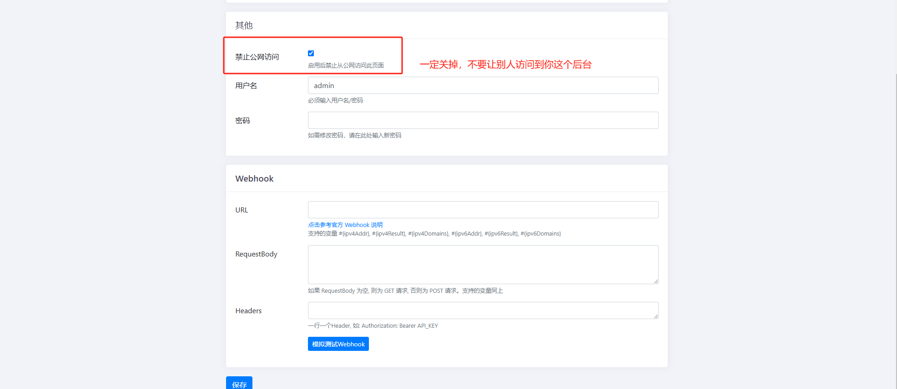

# 在 iStoreOS 软路由环境下的 DSM 使用 DDNS-GO 进行 IPv6 内网穿透的教程

本文档记录了如何在 iStoreOS 环境下配置 DDNS-GO，以实现 DSM 的 IPv6 内网穿透，从而达到无需公网 IPv4 地址即可外网访问 DSM 的效果。

## 硬件说明

#### DSM服务器及软件 
* **群晖** DSM7.2  
  

## 步骤0：写在前头，知识储备

### 1. ipv6是什么？如何打开你软路由的ipv6？
> 1. [OpenWRT 路由器IPv6实战配置长篇教程：纠正你的IPv4思维！](https://post.smzdm.com/p/awzodmpp/)

### 2. 如何设置光猫桥接，软路由拨号
> 1. [联通光猫改软路由拨号](https://post.smzdm.com/p/a07ol6rw/)（本人自用）  
> 2. 其他型号光猫请自行Google保姆级方案  

### 3. 什么是DDNS
> 简单来说就是你的ipv6域名会变（ipv6为动态域名），就需要找一个东西，能时时刻刻检测你变化的ipv6域名，从而自动解析变更你的域名所对应的ipv6地址。

## 步骤 1：到阿里云购买一个域名

1. 访问 [阿里云域名注册](https://wanwang.aliyun.com/) 页面，选择并购买一个域名。
2. 在购买完成后，进入[域名管理控制台](https://dc.console.aliyun.com/#/domain-list/all)以进行后续配置。

## 步骤 2：获取 AccessKey

1. 访问 [阿里云 AccessKey 管理页面](https://ram.console.aliyun.com/manage/ak)。
2. 创建一个新的 AccessKey 并记录下 AccessKey ID 和 AccessKey Secret，稍后将在 DDNS-GO 设置中使用。
   

> ⚠️ **注意：** AccessKey 的权限很重要，请确保保密。并且好好保存！

## 步骤 3：在 iStoreOS 管理后台获取并查看你的 IPv6 公网地址

1. 登录 iStoreOS 后台。
   
2. 导航到 `网络 - WAN 设置`，查看分配到的 IPv6 地址。
   
⚠️ **注意：**  
    1. 你的光猫应该设置为`桥接模式`并且由 **软路由** 进行 `拨号上网`  ，如果不会，请参考 `步骤0`
    2. 你的红框里应该是以`240`开头的ipv6地址（不同运营商的ipv6公网地址开头都不同），而不是`fe`(fe开头的为ipv6局域网地址，不具备公网性质)
    

## 步骤 4：在域名控制台进行域名解析

1. 返回阿里云的[域名管理控制台](https://dc.console.aliyun.com/#/domain-list/all)，左侧选择刚才购买的域名。
   
2. 在“域名解析”选项中，添加一个新的 AAAA 记录（IPv6 地址）。
    - 记录类型：`AAAA`
    - 主机记录：你的子域名xxx（你以后要访问的就是xxx.你的域名）
    - 解析线路：默认
    - 记录值：填写在 iStoreOS 后台查看到的 IPv6 地址
    - TTL：默认值即可
  - 
3. 保存设置，等待解析生效（时间大概10-30min）。

## 步骤 5：在 DSM 套件中心下载 DDNS-GO 并进行相关设置

1. 登录 DSM 系统，进入 `套件中心`。
2. 搜索并安装 `DDNS-GO` 套件。
   
3. 打开 DDNS-GO，按以下步骤进行配置：
    - 服务商：选择 `阿里云`
    - AccessKey ID：填写步骤 2 获取的 AccessKey ID
    - AccessKey Secret：填写步骤 2 获取的 AccessKey Secret
    - 具体设置如下图
  - 
  - 
4. 保存配置，并启动 DDNS-GO，确认 DDNS-GO 已成功更新域名解析。

## 步骤 6：到 iStoreOS - 网络 - 防火墙 - 通信规则设置 WAN 访问规则

1. 登录 iStoreOS 后台，导航到 `网络 - 防火墙 - 通信规则`，。
   
2. 划到下面选择`添加`
   
3. 保存防火墙设置，确保规则已成功生效。(记得点保存，然后再点页面下的 `保存并应用`)

## 步骤 7：使用域名 + 端口访问 DSM

### 完成上述配置后，就可以通过以下方式访问 DSM
- 访问地址：`你的子域名.你的域名:你想访问的端口`

---

# 注意，由于ipv6地址即为公网地址，不存在端口转发一说，所以请小心谨慎对待IP地址的开放以及端口的开放！